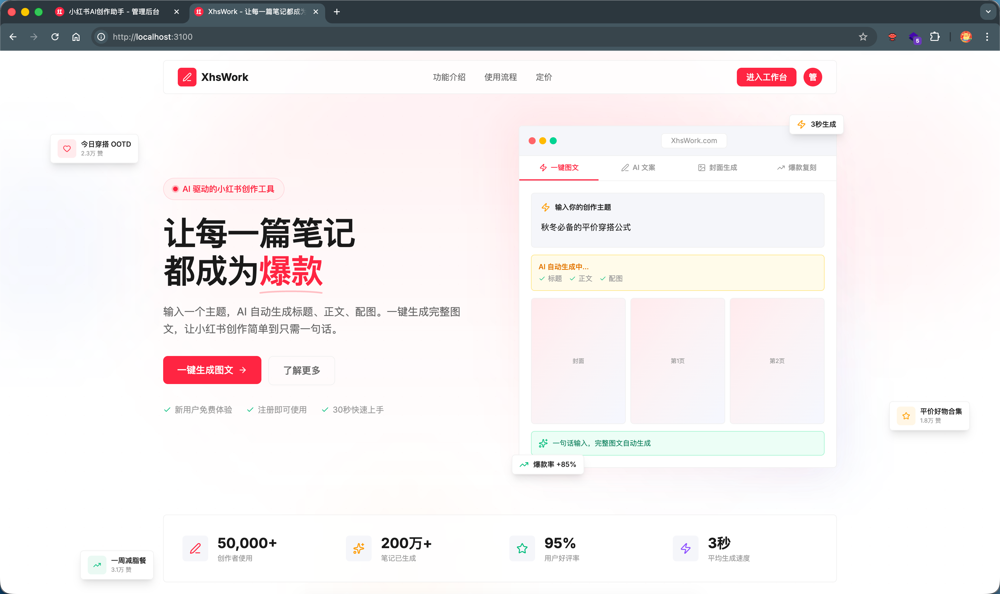
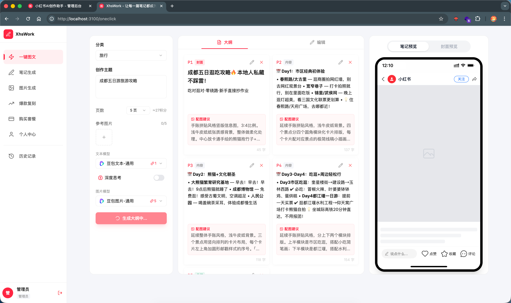
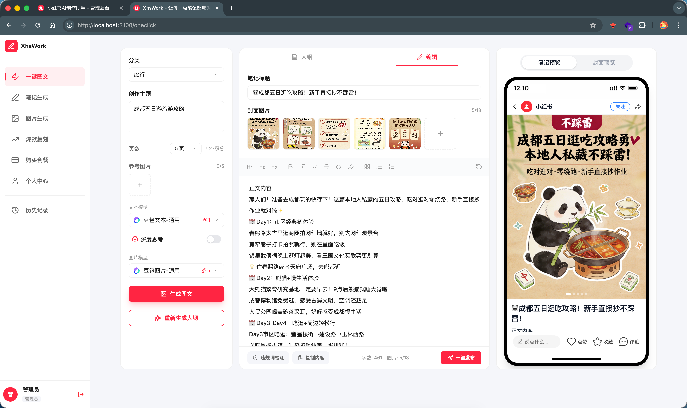
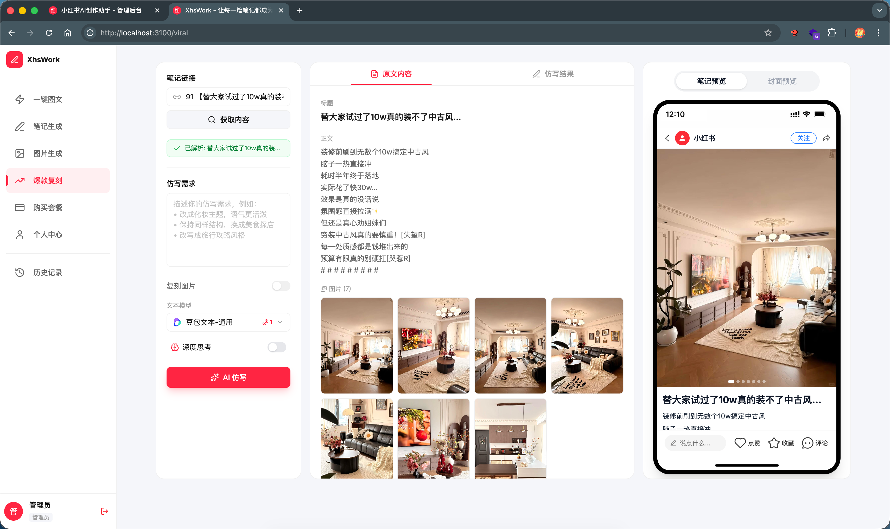
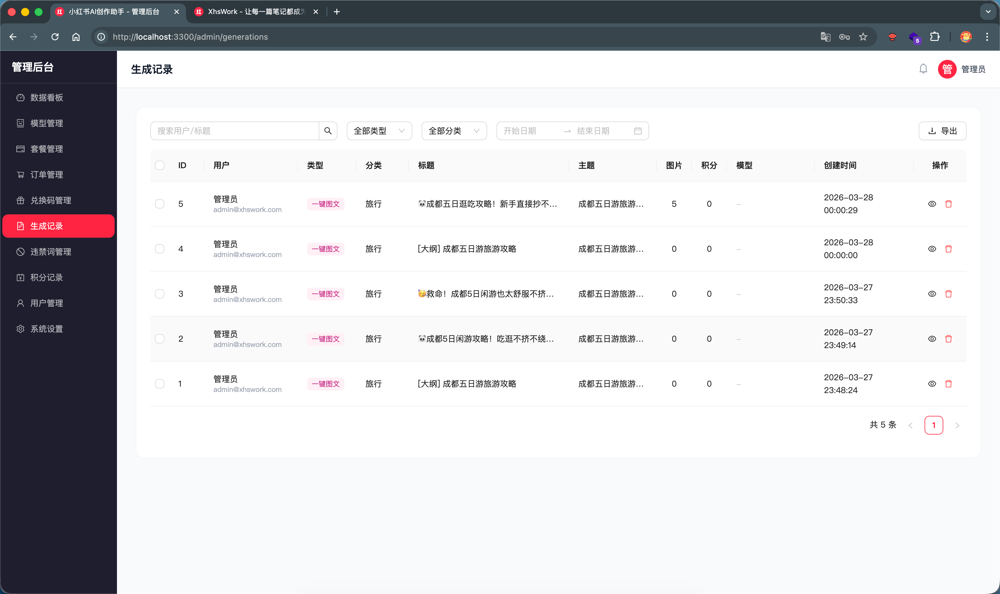

# XHSWork - 小红书 AI 图文创作平台

基于 AI 的小红书内容创作工具，支持一键生成图文、AI 封面设计、爆款笔记仿写、智能编辑器等功能。

演示地址：https://www.xhswork.com/

## 功能特性

### 🎨 AI 创作工具

- **一键图文生成** — 输入主题，AI 自动生成大纲 → 逐页编辑调整 → 批量生成配图，一句话完成完整图文创作
- **AI 封面生成** — 支持文生图 / 图生图两种模式，内置小红书风、简约文字、拼图对比等多种风格预设，自定义尺寸（3:4 / 1:1 / 9:16）
- **爆款复刻** — 粘贴小红书笔记链接，自动解析标题、正文、标签和图片，AI 一键仿写文案 + 复刻图片风格
- **AI 编辑器** — 基于 Plate.js 的富文本编辑器，支持 AI 辅助续写、改写、扩写，选中文本即可调用 AI
- **笔记生成** — 选择风格（活泼俏皮 / 专业干货 / 文艺清新 / 搞笑幽默）和角色（美妆博主 / 美食达人 / 旅行博主等），AI 生成完整笔记
- **违禁词检测** — 内置极限用语、医疗用语、化妆品禁用语、金融用语、法律风险词等 6 大分类违禁词库，自动检测并提供替换建议
- **深度思考** — 文本模型支持深度思考模式，消耗额外积分换取更高质量的内容输出
- **参考图风格分析** — 上传参考图片，AI 分析视觉风格后生成风格一致的配图
- **一键发布** — 生成二维码，使用小红书 App 扫码直接发布

### 📱 用户系统

- **多种登录方式** — 邮箱验证码登录、密码登录、邮箱注册
- **积分系统** — 灵活的积分制，不同 AI 操作消耗不同积分，积分永不过期
- **套餐体系** — 体验包（一次性）、月付、年付、积分充值包，VIP 用户享极速通道和更高图片并发
- **邀请奖励** — 专属邀请码 + 邀请链接，支持注册即奖励 / 充值后奖励两种模式，好友充值可获得比例奖励
- **兑换码** — 支持兑换码充值积分和 VIP 天数
- **历史记录** — 瀑布流展示所有创作记录，支持按类型筛选、预览详情、加载到编辑器继续编辑
- **个人中心** — 账户总览、积分明细、订单记录、邀请统计、修改密码、换绑邮箱

### 💳 支付系统

- **支付宝** — 扫码支付，支持回调验签
- **微信支付** — Native 扫码支付（V3 API），支持 AES-256-GCM 回调解密验签
- **订单管理** — 30 分钟未支付自动过期，支持主动查询支付状态、取消订单
- **积分发放** — 支付成功后事务保护，确保积分和 VIP 权益原子性到账

### 🔧 管理后台

- **数据看板** — 用户数、收入、生成量、积分消耗等实时统计，今日 vs 总量对比
- **模型管理** — 配置多个 AI 模型（文本 / 图片），按套餐等级匹配可用模型，同类型自动轮询负载均衡，支持自定义图标上传
- **用户管理** — 用户列表搜索筛选、查看详情、禁用/启用、手动调整积分、设置 VIP 到期时间、重置密码
- **套餐管理** — 增删改套餐，配置价格、积分、VIP 天数、权益描述、角标、排序、图片并发数
- **订单管理** — 按状态/关键词/日期筛选，统计已支付总金额，支持手动完成订单和取消订单
- **兑换码管理** — 批量生成兑换码，关联套餐或自定义积分/VIP，按状态筛选（未使用/已使用/已过期）
- **违禁词管理** — 按分类管理违禁词库，配置替换词，支持批量导入
- **积分记录** — 所有积分变动的审计日志，按用户/类型/关键词筛选
- **生成记录** — 查看所有用户的生成内容和统计，支持按类型/分类/日期筛选，批量删除
- **系统设置** — SMTP 邮箱、微信支付、支付宝、邀请奖励规则、二维码、图片自动清理天数等配置

## 技术栈

| 模块 | 技术 |
|------|------|
| 后端 | Express 5 + MySQL 8 + mysql2 + JWT + OpenAI SDK |
| 前端 | Vite 8 + React 19 + React Router + TailwindCSS 4 + Plate.js |
| 管理后台 | Vite 7 + React 19 + React Router 7 + Ant Design 5 + TailwindCSS 4 |
| AI 模型 | 兼容 OpenAI SDK 格式（豆包、DeepSeek、通义千问、OpenAI、Claude 等） |
| 支付 | 支付宝（alipay-sdk）+ 微信支付（V3 API） |
| 邮件 | Nodemailer（SMTP） |

## 项目结构

```
xhswork/
├── server/              # 后端 Express.js（端口 3200）
│   ├── controllers/     # 控制器（参数处理、响应格式化）
│   │   ├── admin/       # 管理端接口
│   │   └── web/         # 用户端接口
│   ├── services/        # 业务逻辑层
│   ├── repositories/    # 数据访问层（mysql2 直接操作）
│   ├── routes/          # 路由定义
│   ├── middlewares/      # 中间件（JWT 认证、错误处理、限流）
│   ├── prompts/         # AI Prompt 模板
│   ├── utils/           # 工具函数（AI 调用、密码、邮件、响应）
│   └── database/        # SQL 文件（schema + seed）
├── web/                 # 用户前端 Vite + React（端口 3100）
│   ├── src/
│   │   ├── api/         # API 请求封装
│   │   ├── components/  # 通用组件（编辑器、模型选择器、导航栏等）
│   │   ├── layouts/     # 布局组件（Dashboard 侧边栏布局）
│   │   ├── pages/       # 页面组件
│   │   └── utils/       # 工具函数
│   └── public/          # 静态资源（图标、SVG）
└── admin/               # 管理后台 Vite + React（端口 3300）
    └── src/
        ├── api/         # API 请求封装
        ├── components/  # 布局、认证守卫
        └── pages/       # 管理页面
```

## 环境要求

- Node.js >= 18
- MySQL >= 8.0
- npm >= 9

## 快速开始

### 1. 克隆项目

```bash
git clone https://github.com/Z7ANN/XHSWork.git
cd XHSWork
```

### 2. 配置数据库

登录 MySQL，执行建表和种子数据：

```sql
source server/database/schema.sql;
source server/database/seed.sql;
```

### 3. 配置后端

```bash
cd server
npm install
```

本地开发编辑 `server/.env.development`，生产环境编辑 `server/.env`：

```env
PORT=3200
DB_HOST=localhost
DB_PORT=3306
DB_USER=root
DB_PASSWORD=你的数据库密码
DB_NAME=xhswork
JWT_SECRET=随机字符串
```

### 4. 安装前端依赖

```bash
# 用户前端
cd web
npm install

# 管理后台
cd ../admin
npm install
```

### 5. 配置 AI 模型

启动后端和管理后台后，登录管理后台，在「模型管理」中添加 AI 模型。

支持任何兼容 OpenAI SDK 格式的模型服务，填入 API 地址、API Key 和模型标识即可：

| 模型服务 | API 地址示例 |
|---------|-------------|
| 豆包 | `https://ark.cn-beijing.volces.com/api/v3` |
| DeepSeek | `https://api.deepseek.com/v1` |
| 通义千问 | `https://dashscope.aliyuncs.com/compatible-mode/v1` |
| OpenAI | `https://api.openai.com/v1` |
| Claude | `https://api.anthropic.com/v1` |

### 6. 启动项目

```bash
# 后端（终端 1）
cd server
node app.js

# 用户前端（终端 2）
cd web
npm run dev

# 管理后台（终端 3）
cd admin
npm run dev
```

### 7. 访问

| 服务 | 地址 |
|------|------|
| 用户前端 | http://localhost:3100 |
| 管理后台 | http://localhost:3300/admin |
| 后端 API | http://localhost:3200 |

默认管理员账号：`admin@xhswork.com` / `admin`

## 生产部署

### 构建

前端和管理后台都是纯静态 SPA，本地构建后上传即可，不需要服务器端 Node.js 运行时。

```bash
# 用户前端
cd web && npm run build
# 产物在 web/dist/，上传到服务器 /www/wwwroot/xhswork/web/

# 管理后台
cd admin && npm run build
# 产物在 admin/dist/，上传到服务器 /www/wwwroot/xhswork/admin/

# 后端
# 上传 server/ 目录到服务器 /www/wwwroot/xhswork/server/
# 配置 server/.env（生产环境数据库密码、JWT 密钥等）
# 服务器执行：
cd /www/wwwroot/xhswork/server
npm install --production
```

### PM2 进程管理

只需要管理后端进程，前端和管理后台都是纯静态文件由 Nginx 直接提供。

```bash
# 启动后端
NODE_ENV=production pm2 start /www/wwwroot/xhswork/server/app.js --name xhswork-server

# 保存进程列表 & 开机自启
pm2 save
pm2 startup
```

### Nginx 配置

```nginx
server {
    listen 80;
    server_name your-domain.com;

    # 后端 API + SSE 流式接口
    location /api/ {
        proxy_pass http://127.0.0.1:3200;
        proxy_set_header Host $host;
        proxy_set_header X-Real-IP $remote_addr;
        proxy_set_header X-Forwarded-For $proxy_add_x_forwarded_for;
        proxy_read_timeout 300s;
        proxy_buffering off;          # SSE 流式响应必须关闭缓冲
        client_max_body_size 20m;
    }

    # 管理后台（静态文件）
    location /admin/ {
        alias /www/wwwroot/xhswork/admin/;
        try_files $uri $uri/ /admin/index.html;
    }

    # 用户前端（静态文件 SPA）
    location / {
        root /www/wwwroot/xhswork/web;
        try_files $uri $uri/ /index.html;
    }
}
```

### 更新部署

```bash
# 前端更新：本地 build 后上传 dist/ 覆盖即可，无需重启
# 后端更新：上传代码后
cd /www/wwwroot/xhswork/server
npm install --production    # 如果依赖有变动
pm2 restart xhswork-server
```

## 截图演示

### 首页



### 一键图文生成





### 爆款复刻



### 管理后台 - 生成记录



## 联系作者

如有疑问，欢迎加微信交流（请备注 xhswork）

| 加作者微信 | 微信交流群 |
|:---:|:---:|
|  |  |

## License

MIT
